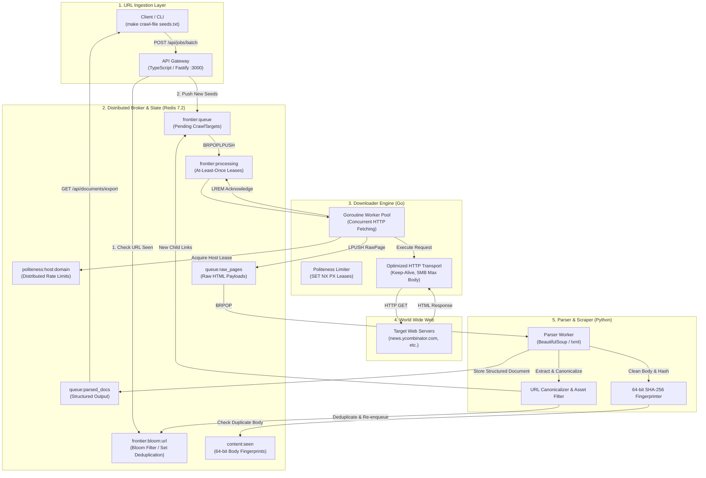
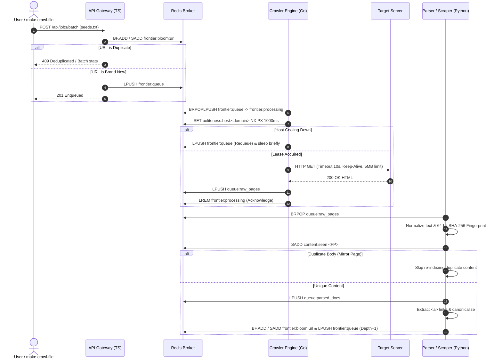

# 🕷️ Distributed Web Crawler & Scraper Monorepo

[](https://go.dev/)
[](https://www.typescriptlang.org/)
[](https://fastify.dev/)
[](https://www.python.org/)
[](https://redis.io/)
[](https://www.docker.com/)
[](LICENSE)

An enterprise-grade, high-throughput distributed web crawler and scraper monorepo inspired by **Chapter 9 of Alex Xu's *"System Design Interview"***. Built with a polyglot architecture separating high-concurrency network I/O (Go) from CPU-intensive DOM parsing (Python) and strict API orchestration (TypeScript/Fastify), backed by Redis.

---

## 🏛️ System Architecture

### Component Topology


---

### Distributed Crawl Lifecycle


---

## ✨ Core Engineering Features

1. **Dual-Layer Deduplication (URL & Content)**:
   - **URL Layer**: Uses **RedisBloom (`BF.ADD`)** on `frontier:bloom:url` for memory-efficient membership testing across millions of URLs, with seamless fallback to Redis Sets (`frontier:seen`).
   - **Content Layer**: Normalizes DOM bodies (stripping boilerplate scripts, headers, footers) and computes a **64-bit SHA-256 fingerprint** stored in `content:seen` to eliminate duplicate or mirror pages under different URLs.
2. **Reliable URL Frontier**:
   - Atomic job transition via `BRPOPLPUSH` between `frontier:queue` and `frontier:processing` to guarantee **at-least-once delivery** if a crawler worker crashes mid-download.
3. **Per-Host Politeness & Rate-Limiting**:
   - Prevents target server overload by enforcing atomic distributed leases (`SET politeness:host:<domain> <worker_id> NX PX <delay_ms>`). Rate-limited targets are safely requeued.
4. **Decoupled Polyglot Architecture**:
   - **Network I/O**: Go engine handles high-concurrency HTTP downloading with persistent connection pools (`MaxIdleConnsPerHost: 50`) and response size caps.
   - **CPU-bound Scraping**: Python service parses DOM trees, cleans boilerplate, and extracts metadata in an isolated process.
   - **API Gateway**: Fastify (TypeScript) performs schema validation, batch ingestion pipelining, and exposes real-time telemetry.
5. **Living Contract Verification**:
   - Strongly typed JSON Schemas in `shared/contracts/` strictly mapped to Go structs, Python Pydantic models, and TypeScript interfaces.

---

## ⚡ Quickstart

### 🚀 One-Command Launch (Native / Fast)
Start all services (Redis check, Fastify Gateway, Go Crawler, Python Parser) with a single command:
```bash
make start
```
*(Press `Ctrl+C` at any time to cleanly stop all services together).*

---

### 🐳 Alternative: Full Docker Compose Launch
```bash
make cluster-up
```

---

## 🎯 How to Run a Crawl Test

### 1. Ingest Seed URLs
Feed URLs from `seeds.txt` directly into the distributed pipeline:
```bash
make crawl-file FILE=seeds.txt
```
*Or submit a single target:*
```bash
make submit-job URL=https://news.ycombinator.com
```

### 2. Inspect Real-Time Telemetry
Query queue depths, active in-flight crawls, and Bloom filter stats:
```bash
make get-metrics
```
*Example response:*
```json
{
  "pending_queue": 1365,
  "in_flight_processing": 13,
  "raw_pages_for_parser": 0,
  "parsed_documents_total": 83,
  "unique_urls_seen": 1475,
  "timestamp": "2026-09-28T23:02:05.055Z"
}
```

### 3. Export Extracted Documents
Download all parsed documents into `output.json`:
```bash
make export-results
```

### 4. Stop All Services
```bash
# If running via Docker Compose:
make cluster-down
```

---

## 📡 REST API Reference

The API Gateway runs at `http://localhost:3000`.

| Method | Endpoint | Description | Payload / Query | Response |
| :--- | :--- | :--- | :--- | :--- |
| `POST` | `/api/jobs` | Submit a single seed URL | `{"url": "https://go.dev", "max_depth": 2}` | `201 Created` or `409 Conflict` |
| `POST` | `/api/jobs/batch` | Batch ingest array of URLs | `{"urls": ["https://site1.com", "https://site2.com"]}` | `201 Created` with batch stats |
| `GET` | `/api/jobs/:id` | Fetch job status metadata | Path parameter `id` (UUID) | `200 OK` with job details |
| `GET` | `/api/metrics` | Real-time cluster telemetry | None | `200 OK` (queues & Bloom count) |
| `GET` | `/api/documents` | Retrieve latest parsed documents | `?limit=20` (max 50) | `200 OK` with documents array |
| `GET` | `/api/documents/export` | Export all documents to JSON file | None | `200 OK` (`crawled_documents.json`) |
| `GET` | `/healthz` | Cluster health probe | None | `200 OK` `{"status": "healthy"}` |

---

## 🛠️ Developer Make Targets

| Target | Description |
| :--- | :--- |
| `make start` | 🚀 **One-Command Launch**: Starts Redis check, Gateway, Crawler, and Parser concurrently |
| `make cluster-up` | Build and start all 4 services via Docker Compose |
| `make cluster-down` | Stop and remove cluster containers cleanly |
| `make crawl-file FILE=seeds.txt` | Ingest batch URLs from file |
| `make submit-job URL=...` | Submit a single seed URL |
| `make get-metrics` | Fetch real-time cluster metrics |
| `make get-docs` | Fetch recent extracted documents |
| `make export-results` | Export all documents to `output.json` |
| `make test-all` | Run test suites across Go, Python, and TypeScript |
| `make test-go` | Run Go unit tests |
| `make test-python` | Run Python pytest suite |
| `make test-gateway` | Run Fastify Vitest suite |

---

## 🧪 Testing Matrix

All test suites run deterministically in isolated environments without external service dependencies:
```bash
make test-all
```

- **Go**: Validates HTTP transport timeout handling and keep-alive connection pooling.
- **Python**: Validates URL canonicalization, fragment removal, asset filtering, and duplicate content detection.
- **TypeScript**: Validates Fastify request schemas, batch ingestion pipelining, and error handling.

---

## 📂 Repository Layout

```text
.
├── Makefile                     # Developer workflow and orchestration targets
├── scripts/
│   └── start.sh                 # One-command concurrent runner with unified shutdown
├── docker-compose.yml           # Multi-service composition (Redis, Go, Py, TS)
├── seeds.txt                    # Sample seed URL ingestion file
├── OVERVIEW.md                  # Comprehensive architectural deep-dive
├── shared/
│   └── contracts/               # Shared JSON Schema data contracts
│       ├── crawl_target.json    # Target URL contract (Go input)
│       ├── raw_page.json        # Raw HTML contract (Go -> Python)
│       ├── parsed_document.json # Structured document contract (Python output)
│       └── REDIS_SPEC.md        # Redis key topology specification
├── services/
│   ├── api-gateway/             # Node.js / TypeScript / Fastify API service
│   │   ├── src/                 # Fastify server, routes, and Bloom filter check
│   │   ├── Dockerfile
│   │   └── package.json
│   ├── crawler-engine/          # Go high-throughput HTTP downloader
│   │   ├── internal/            # Worker pool, Fetcher, Politeness limiter
│   │   ├── main.go
│   │   ├── Dockerfile
│   │   └── go.mod
│   └── parser-scraper/          # Python DOM extraction & link discovery
│       ├── app/                 # BeautifulSoup extractor, fingerprinting, pipeline
│       ├── parser_worker.py
│       ├── Dockerfile
│       └── requirements.txt
```

---

## 📄 License
This project is open-source under the [MIT License](LICENSE).
